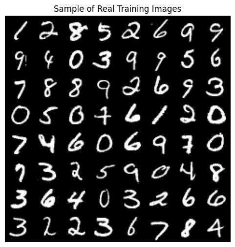
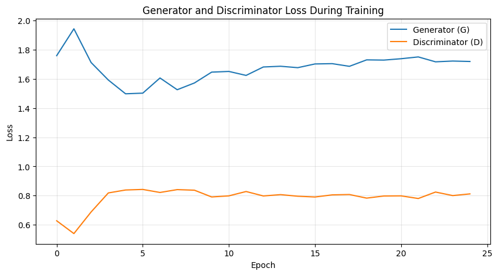
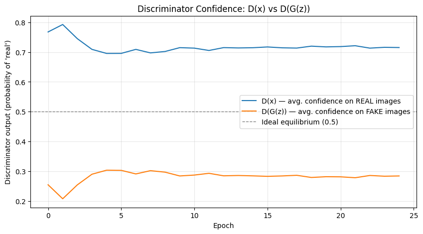
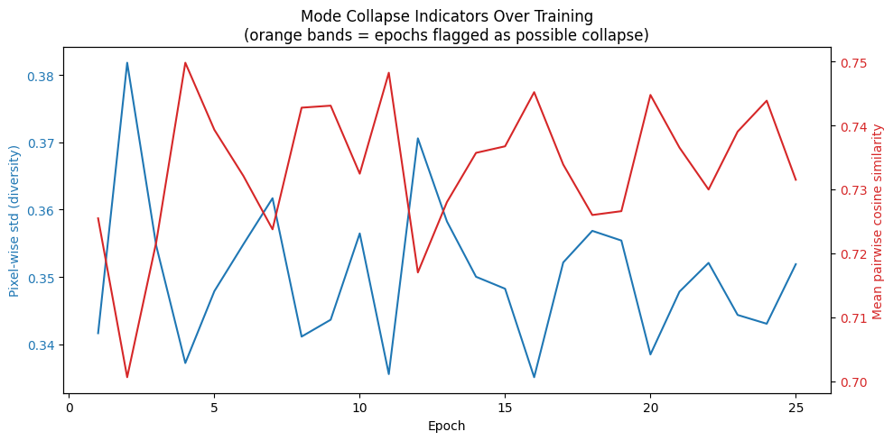
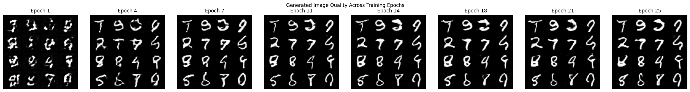
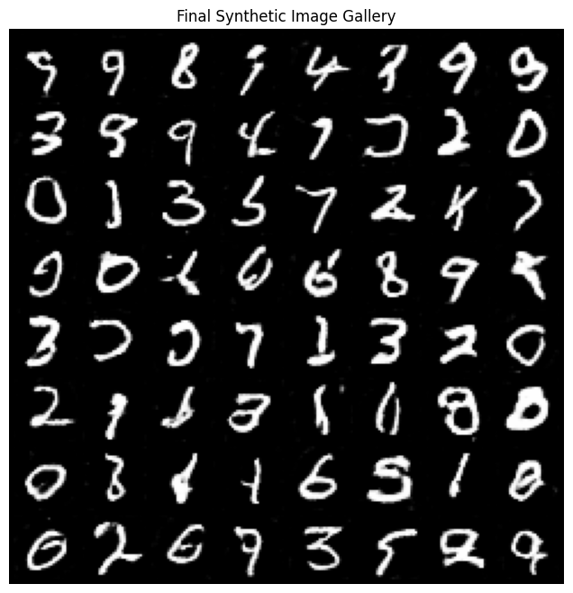

# DCGAN Synthetic Face/Digit Generator

A Deep Convolutional Generative Adversarial Network (DCGAN) built with PyTorch to generate synthetic images from random noise, trained on the MNIST handwritten digit dataset (with an optional switch to CelebA faces).

This project was completed as Minor Project 10 - Artificial Intelligence.

## Overview

The notebook builds and trains a full DCGAN pipeline end to end:

- Generator network (transposed-convolutional stack)
- Discriminator network (strided-convolutional classifier)
- Training loop with Generator and Discriminator loss tracking
- Synthetic image generation at different epochs
- Mode collapse detection (pixel diversity and pairwise similarity heuristics)
- GAN training stability analysis (D(x) vs D(G(z)) convergence)
- Visualization of generated outputs and an auto-generated training report

## Project Structure

```
.
├── DCGAN_Synthetic_Face_Digit_Generator.ipynb   Main notebook (run top to bottom)
├── requirements.txt                             Python dependencies
├── checkpoints/
│   ├── generator.pth                            Trained generator weights
│   ├── discriminator.pth                        Trained discriminator weights
│   └── dcgan_full_checkpoint.pth                Full resumable training checkpoint
├── outputs/
│   ├── real_samples.png                         Sample of real training images
│   ├── loss_curves.png                          Generator vs Discriminator loss
│   ├── stability_Dx_DGz.png                     D(x) vs D(G(z)) stability analysis
│   ├── mode_collapse_trend.png                  Mode collapse indicators over training
│   ├── epoch_progression.png                    Generated image quality across epochs
│   ├── gallery_final.png                        Final synthetic image gallery
│   └── epoch_grids/                             Per-epoch generated image grids
└── reports/
    └── GAN_Training_Analysis_Report.md          Auto-generated training analysis report
```

## Setup

```bash
git clone https://github.com/<your-username>/dcgan-synthetic-face-digit-generator.git
cd dcgan-synthetic-face-digit-generator
pip install -r requirements.txt
```

Then open `DCGAN_Synthetic_Face_Digit_Generator.ipynb` in Jupyter or Google Colab and run all cells. A GPU runtime is recommended for reasonable training time.

## Configuration

Key settings at the top of the notebook:

| Parameter | Default | Description |
|---|---|---|
| `DATASET` | `"mnist"` | `"mnist"` or `"celeba"` |
| `NUM_EPOCHS` | `25` | Increase for higher-quality outputs |
| `BATCH_SIZE` | `128` | Training batch size |
| `NZ` | `100` | Latent noise vector size |
| `LR` | `2e-4` | Adam learning rate |

## Results

### Real training samples


### Generator vs Discriminator loss


### Training stability: D(x) vs D(G(z))


### Mode collapse trend over training


### Generated image quality across epochs


### Final synthetic image gallery


## Deliverables

- Trained GAN model: `checkpoints/generator.pth`, `checkpoints/discriminator.pth`, `checkpoints/dcgan_full_checkpoint.pth`
- Synthetic image gallery: `outputs/gallery_final.png`, `outputs/epoch_progression.png`, `outputs/epoch_grids/`
- GAN training analysis report: `reports/GAN_Training_Analysis_Report.md`

## Loading the trained generator for inference

```python
import torch
from notebook_module import Generator   # or paste the Generator class definition

device = torch.device("cuda" if torch.cuda.is_available() else "cpu")
netG = Generator().to(device)
netG.load_state_dict(torch.load("checkpoints/generator.pth", map_location=device))
netG.eval()

with torch.no_grad():
    z = torch.randn(64, 100, 1, 1, device=device)
    samples = netG(z)
```

## Tech Stack

- Python
- PyTorch and torchvision
- NumPy
- Matplotlib

## License

This project is released for educational purposes.
